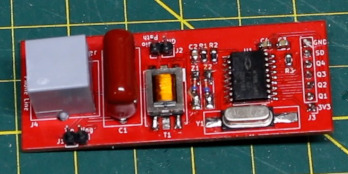

# DTMF_Decoder_3V3
MT88L70 based DTMF decoder with 3.3v power/logic
    
This DTMF decoder uses the MT88L70, powered by 3.3v and interfacing with 3.3v GPIO to decode the touch tone keys. 
It has an RJ phone jack and 600:600 transformer to connect to a phone line to pick up audio, listening for DTMF tone pairs.  
Note: It is recommended to only connect this circuit to a phone line after it is taken off hook to keep the AC voltages low, such as audio signals and not a high voltage ring signal.
This can be achieved by switching the circuit into the phone line with a relay.

This circuit has only been tested on a simulated phone line in a workshop environment and is not guaranteed to meet official telephone line specifications.
